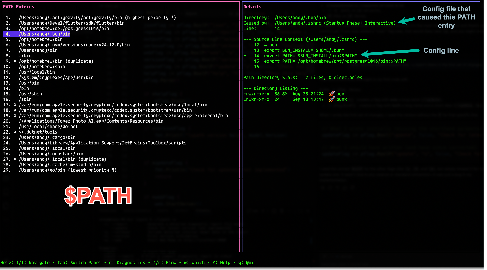
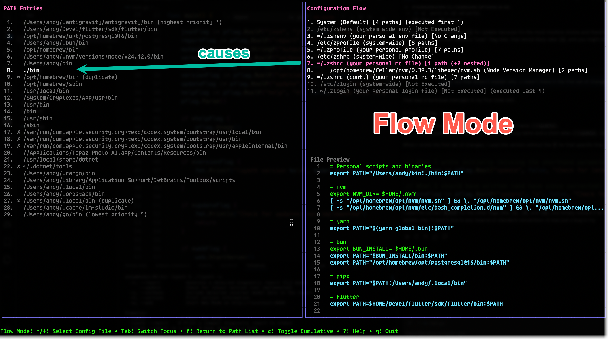
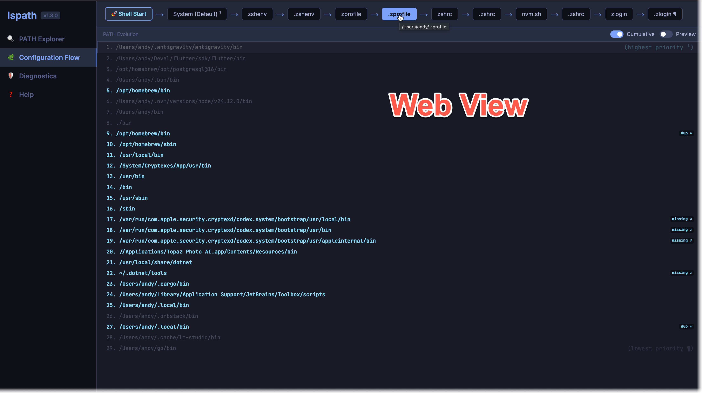

# lspath

[](https://github.com/abulka/lspath/releases)

**lspath** is a powerful terminal-based tool designed to help you analyze, debug, and optimize your system's `PATH`. It visualizes how your PATH is constructed by your shell's startup sequence and identifies common issues like duplicates and missing directories.

---

## � Screenshots

### Interactive TUI


### Shell Startup Flow


### Web Dashboard


---

## �🚀 Features

### 🖥️ TUI Mode (Default)
Interactive terminal interface built with [Bubble Tea](https://github.com/charmbracelet/bubbletea).
- **Flow Mode**: Visualize the "evolution" of your PATH as shell startup files (`.zshrc`, `.zprofile`, etc.) are executed.
- **Diagnostics**: Instantly identify broken links, missing directories, and duplicate entries.
- **Which Mode**: Find where commands are located and identify "shadowed" binaries.
- **File Preview**: Inspect the exact lines in your configuration files that modify the PATH.

### 🌐 Web Mode
Start a local web server to explore your PATH in a modern browser.
- **Interactive Visualization**: Explore the directory structure and shell trace visually.
- **Status Dashboard**: Quick overview of PATH health.

### ⌨️ CLI Mode
Non-interactive mode for scripting and quick reports.
- **JSON Output**: Export raw analysis data for downstream processing.
- **Diagnostic Reports**: Generate compact or detailed human-readable reports.

---

## 🛠️ Installation

### Packages (Recommended)

#### Ubuntu / Debian (x86_64 & ARM)
```bash
# For x86_64:
curl -sLO https://github.com/abulka/lspath/releases/latest/download/lspath_amd64.deb
sudo apt install ./lspath_amd64.deb

# For ARM64:
curl -sLO https://github.com/abulka/lspath/releases/latest/download/lspath_arm64.deb
sudo apt install ./lspath_arm64.deb
```

#### Fedora / RHEL / CentOS (x86_64 & ARM)
Fedora can install directly from the URL:
```bash
# For x86_64:
sudo dnf install https://github.com/abulka/lspath/releases/latest/download/lspath_x86_64.rpm

# For ARM64:
sudo dnf install https://github.com/abulka/lspath/releases/latest/download/lspath_aarch64.rpm
```

#### Fedora Silverblue (Toolbox)
To keep your host system clean, install `lspath` inside a toolbox. By default, this uses your default toolbox container:
```bash
# Replace x86_64 with aarch64 if on ARM
toolbox run sudo dnf install https://github.com/abulka/lspath/releases/latest/download/lspath_x86_64.rpm
```

If you have multiple toolboxes and want to target a specific one (e.g., `my-dev-box`):
```bash
toolbox run -c my-dev-box sudo dnf install ...
```

To run it from your host terminal:
```bash
toolbox run lspath
# Or for a specific container
toolbox run -c my-dev-box lspath
```

#### Distrobox
If you are using Distrobox (e.g., on Steam Deck or MicroOS), you can install it into any container:
```bash
# Example for a Fedora-based container named 'my-box'
distrobox enter my-box -- sudo dnf install https://github.com/abulka/lspath/releases/latest/download/lspath_x86_64.rpm

# Example for a Debian-based container
distrobox enter debian-box -- curl -sLO https://github.com/abulka/lspath/releases/latest/download/lspath_amd64.deb
distrobox enter debian-box -- sudo apt install ./lspath_amd64.deb
```

Run it from the host:
```bash
distrobox enter my-box -- lspath
```

#### macOS (Binary)
```bash
# Download the latest binary for your architecture (x86_64 or arm64)
curl -sLO https://github.com/abulka/lspath/releases/latest/download/lspath_Darwin_$(uname -m).tar.gz
tar -xzf lspath_Darwin_$(uname -m).tar.gz
sudo mv lspath /usr/local/bin/
```

#### Windows
Download the `.zip` archive from the [Releases](https://github.com/abulka/lspath/releases) page, extract it, and add the folder to your `PATH`.

### Building from Source
Ensure you have [Go](https://go.dev/) installed (version 1.24+ recommended).

```bash
git clone https://github.com/abulka/lspath.git
cd lspath
go build -o lspath main.go
```

---

## � Upgrading

You can check if a new version is available by running:
```bash
lspath --update
```

### To perform the upgrade:

#### Ubuntu / Debian
Simply re-run the `curl` and `apt install` commands from the installation section. `apt` will automatically detect the newer version and upgrade it.

#### Fedora / RHEL
Re-run the `dnf install` command with the latest URL. Use `--refresh` if the package manager has cached the old metadata:
```bash
sudo dnf install --refresh https://github.com/abulka/lspath/releases/latest/download/lspath_x86_64.rpm
```

#### macOS (Binary)
Download and extract the latest version over your existing binary:
```bash
curl -sLO https://github.com/abulka/lspath/releases/latest/download/lspath_Darwin_$(uname -m).tar.gz
tar -xzf lspath_Darwin_*.tar.gz
sudo mv lspath /usr/local/bin/
```

---

## �📖 Usage

Run `lspath` without arguments to enter the interactive TUI.

```bash
lspath [options]
```

### Options

| Short | Long | Description |
| :--- | :--- | :--- |
| `-h` | `--help` | Show help message |
| `-r` | `--report` | Generate a detailed diagnostic report (CLI mode) |
| `-v` | `--verbose` | Include detailed internal model data in the report |
| `-o` | `--output` | Save report to a specified file (requires `-r`) |
| `-j` | `--json` | Output raw analysis data as JSON |
| `-w` | `--web` | Start Web Mode on http://localhost:8080 |
| `-V` | `--version` | Print version information |
| `-u` | `--update` | Check for latest version |

### Examples

```bash
# Start interactive TUI
lspath

# Print a diagnostic report to stdout
lspath --report

# Save a verbose report to a text file
lspath -r -v -o path_debug.txt

# Export analysis as JSON for other tools
lspath --json > path_data.json

# Start the web interface
lspath --web
```

---

## ⌨️ TUI Keyboard Shortcuts

| Key | Action |
| :--- | :--- |
| `↑/↓` or `k/j` | Navigate PATH entries |
| `f` | Toggle **Flow Mode** (trace shell startup) |
| `w` | Toggle **Which Mode** (search for binaries) |
| `d` | Show **Diagnostics** report |
| `c` | Toggle **Cumulative View** in Flow Mode |
| `q` or `Ctrl+C` | Quit |

---

---

## 🛠️ Development

For information on local setup, build testing, and the release process, see [doco/development.md](doco/development.md).

## Help 

See [internal/tui/help.md](internal/tui/help.md) for help shown by the internal help system.

## 📜 License
[MIT](LICENSE)
